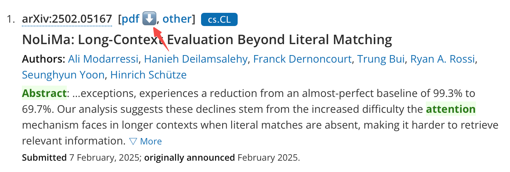
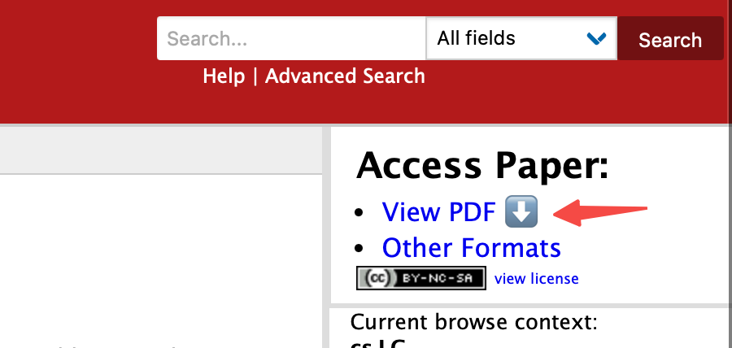
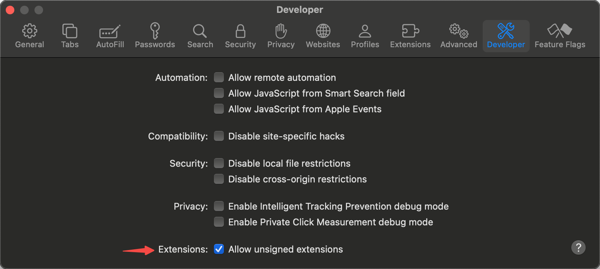
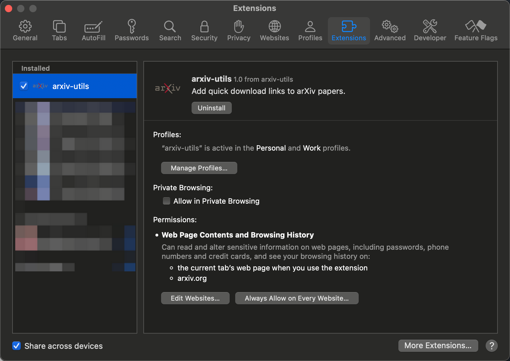

# Arxiv Utils for Safari

This is a Safari extension which adds a download emoji to arxiv.org pdf links.

## Screenshots

## Installation

Since this extension is not available on the Safari Extensions Gallery(caused by the $99/year fee), you have to compile and install it manually.

1. Clone this repository.
2. Open the `arxiv-utils.xcodeproj` file with Xcode.
3. [Optional] Change the `Bundle Identifier` to your own.
4. [Optional] Change the `Signing & Capabilities` to your own.
5. Build the project.
6. Open the built `arxiv-utils.app` file.
7. Open Safari and allow unsigned extensions in the `Preferences` -> `Developr` menu.
    
8. Open Safari and enable the extension in the `Preferences` -> `Extensions` -> `Arxiv Utils`.
    

